# KAN-Free-Boundary-PDE

This repository implements Kolmogorov-Arnold Network (KAN)-based physics-informed solvers for free-boundary partial differential equations (PDEs). The main focus is on using structured KAN representations to approximate both the PDE solution and the evolving free boundary.

The repository includes examples for:

- The two-dimensional one-phase Stefan problem
- Elliptic obstacle problems
- Nonlinear p-Laplacian obstacle problems
- Free-boundary PDEs with known analytical solutions
- Error visualization and time-dependent animations

---

## 1. KAN Solver for the Time-Dependent Stefan Problem

The main example in this repository is the two-dimensional one-phase Stefan problem. The goal is to learn both the time-dependent solution

$$
u(x_1,x_2,t)
$$

and the moving free boundary

$$
s(x_2,t),
$$

using a KAN-based physics-informed neural solver.

The computational domain is

$$
(x_1,x_2,t) \in [0,2.25]\times[0,1]\times[0,1],
$$

with the moving physical domain defined by

$$
0 < x_1 < s(x_2,t), \qquad 0 < x_2 < 1, \qquad 0 \leq t \leq 1.
$$

The KAN model is trained by minimizing residual losses associated with:

- the heat equation,
- the initial condition,
- boundary conditions,
- the interface condition,
- and the Stefan free-boundary condition.

---

## 2. Time-Dependent KAN Prediction and Error

The animation below shows the learned KAN solution $u_{\mathrm{KAN}}(x_1,x_2,t)$ evolving from $t=0$ to $t=1$, together with the pointwise absolute error.

Left panel: predicted KAN solution as a 3D surface.  
Right panel: absolute error as a 2D heatmap.

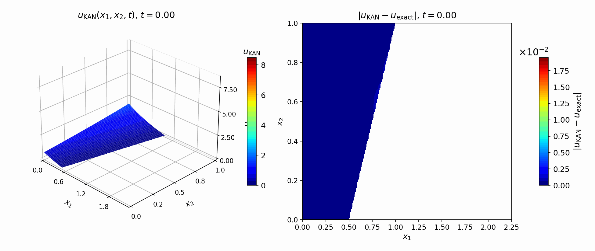

---

## 3. Training Logs

The training curves summarize the convergence of the KAN-based Stefan solver. The loss plot reports the evolution of the total loss and individual physics-informed loss components, including the heat-equation residual, initial-condition loss, interface loss, and Stefan-condition loss. The relative-error plot tracks the accuracy of the learned solution during training.

  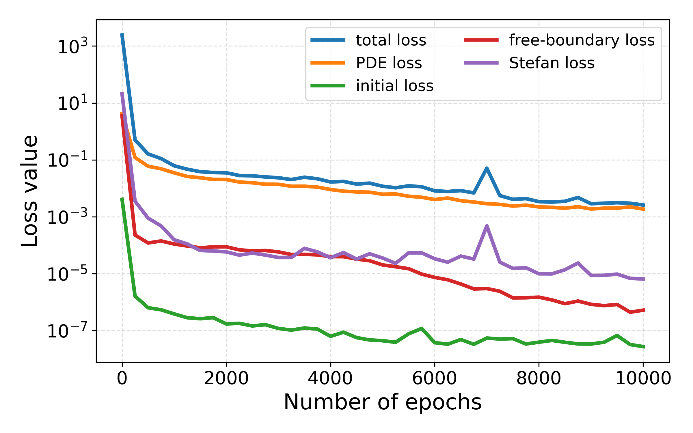
  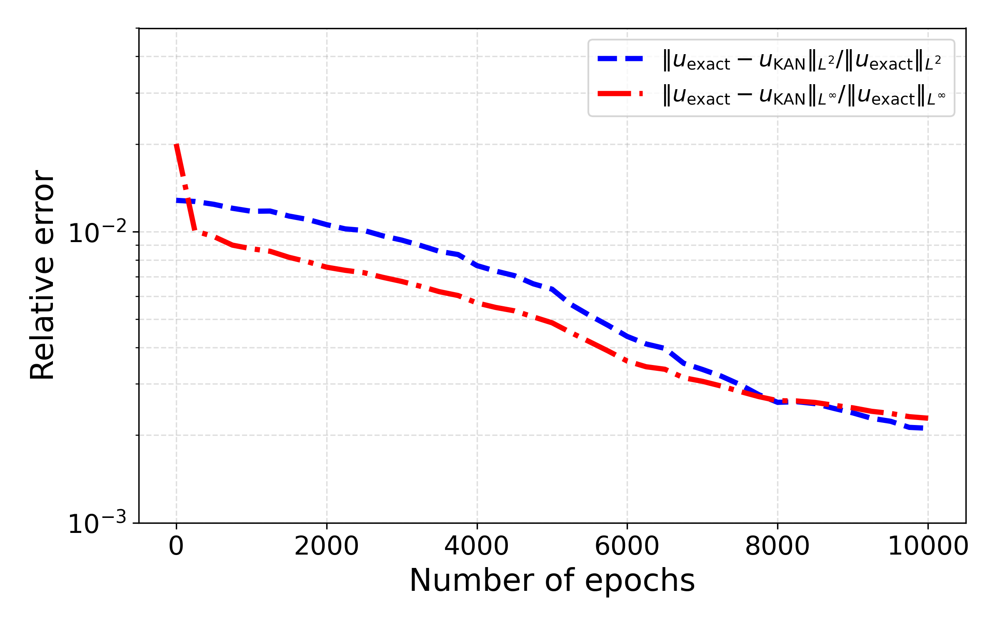

  <b>Left:</b> training loss components.
  &nbsp;&nbsp;&nbsp;
  <b>Right:</b> relative $L^2$ and $L^\infty$ errors.

---

## 4. Learned Free Surface

The free-boundary network learns the moving interface $\hat{s}(x_2,t)$ over the space-time domain. The panels below compare the exact free surface, the KAN-predicted free surface, and the logarithmic absolute error.

Left panel: exact free surface $s(x_2,t)$.  
Middle panel: predicted free surface $\hat{s}(x_2,t)$.  
Right panel: logarithmic absolute error $\log_{10}|s_{\mathrm{KAN}}-s_{\mathrm{exact}}|$.

  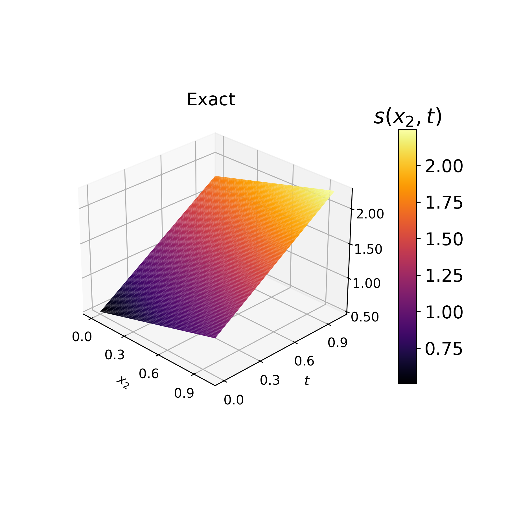
  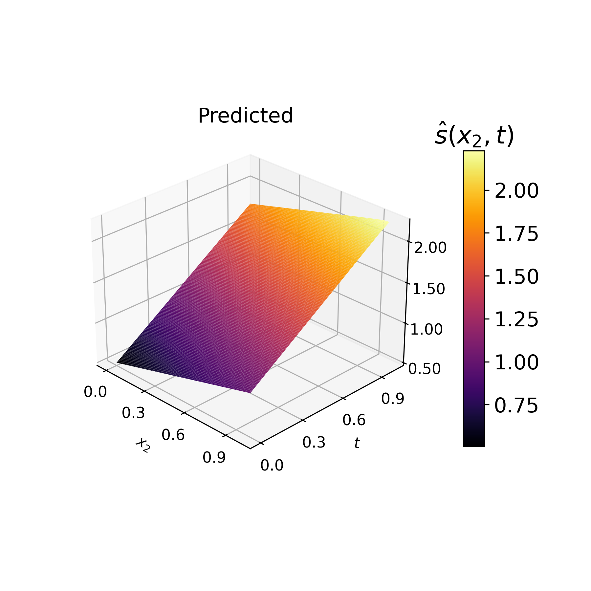
  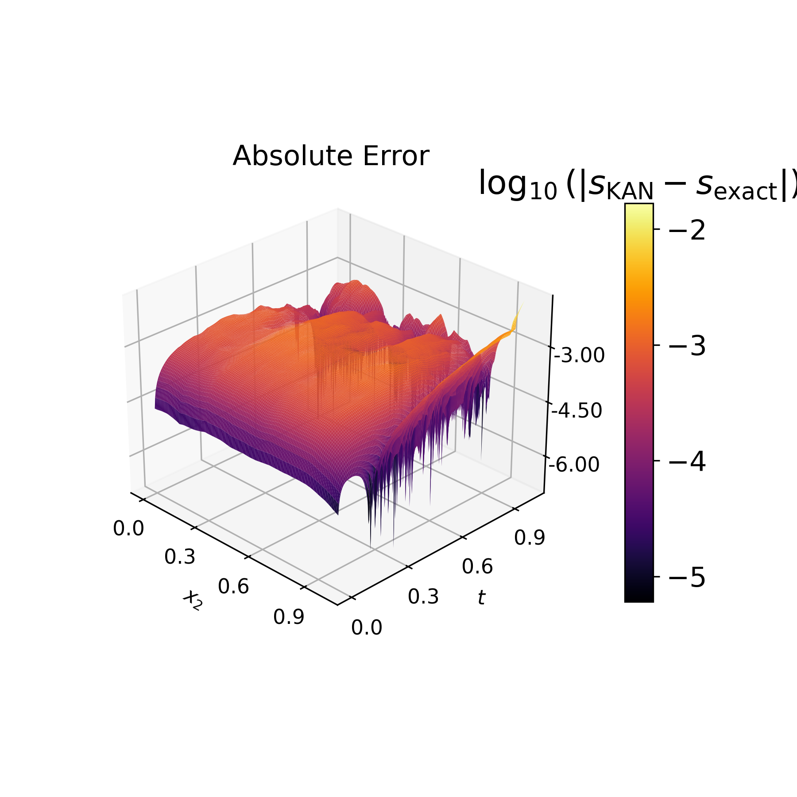

---

---

## 5. KAN Solver for the p-Laplacian Obstacle Problem

This repository also includes a KAN-based physics-informed solver for a nonlinear p-Laplacian obstacle problem. This problem extends the classical obstacle formulation by replacing the standard Laplacian operator with the nonlinear p-Laplacian operator.

The goal is to approximate the constrained solution

$$
u(x_1,x_2)
$$

subject to the obstacle condition

$$
u(x_1,x_2) \geq \psi(x_1,x_2),
$$

where $\psi$ is the prescribed obstacle function.

The p-Laplacian operator is given by

$$
\Delta_p u
= \nabla \cdot \left(|\nabla u|^{p-2}\nabla u\right),
$$

so the model must learn a solution satisfying both the nonlinear PDE constraint and the free-boundary/contact-region structure.

The KAN approximation is trained using residual-based loss terms associated with:

- the obstacle constraint,
- the nonlinear p-Laplacian residual,
- the complementarity condition,
- and the boundary condition.

The numerical results compare the KAN approximation with baseline neural-network architectures and visualize the predicted solution, pointwise error, and training convergence.

### p-Laplacian Obstacle Problem Results

The panels below show the obstacle function, exact solution, KAN approximation, pointwise absolute error, and convergence curves for the p-Laplacian obstacle problem.

<!-- Update these paths to match your repository if needed. -->

  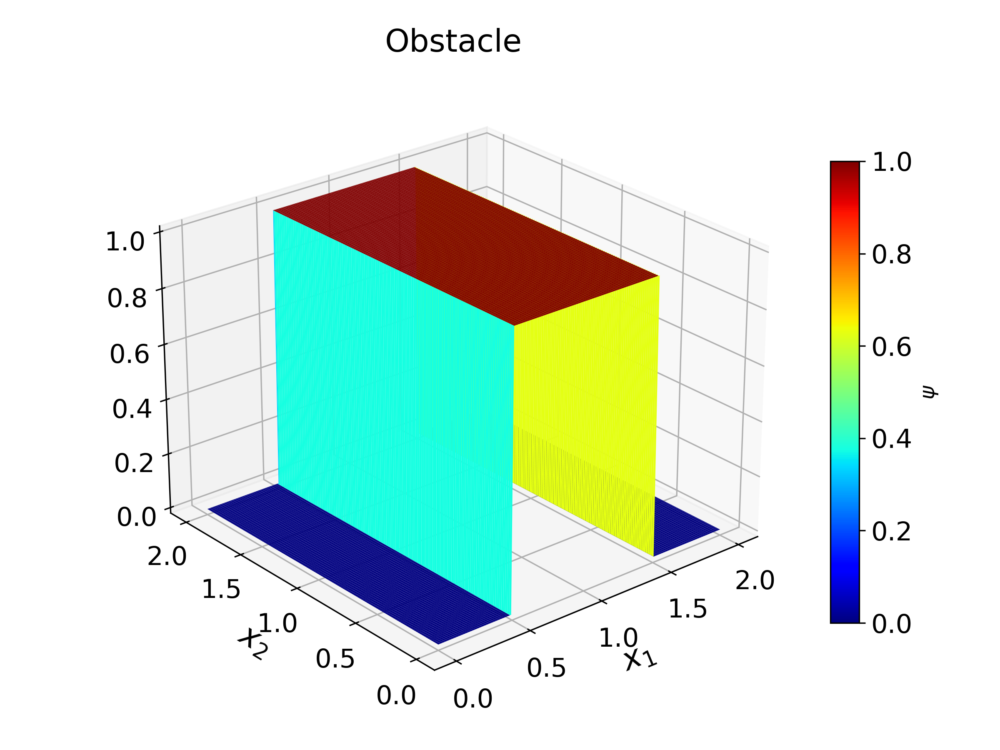

  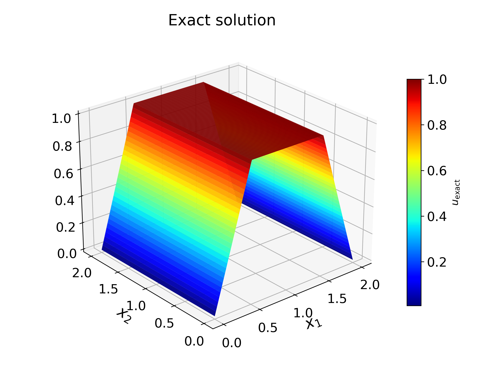
  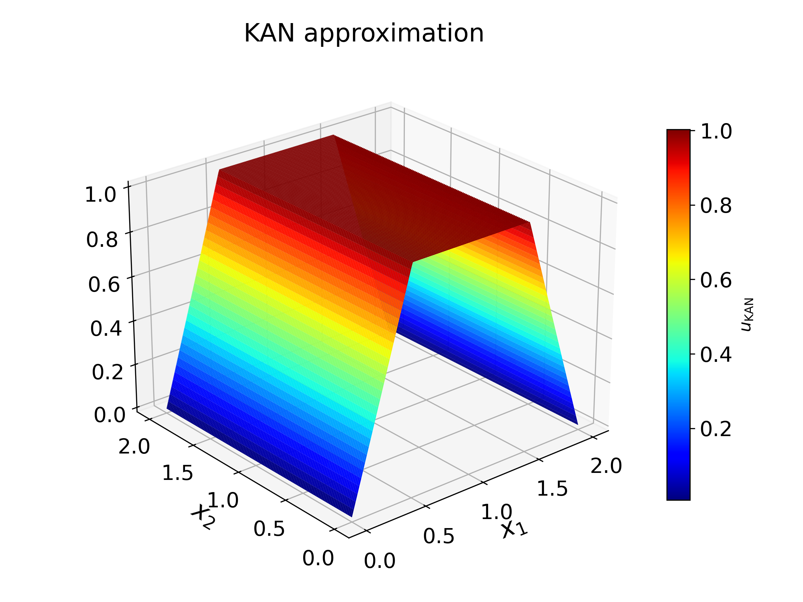
  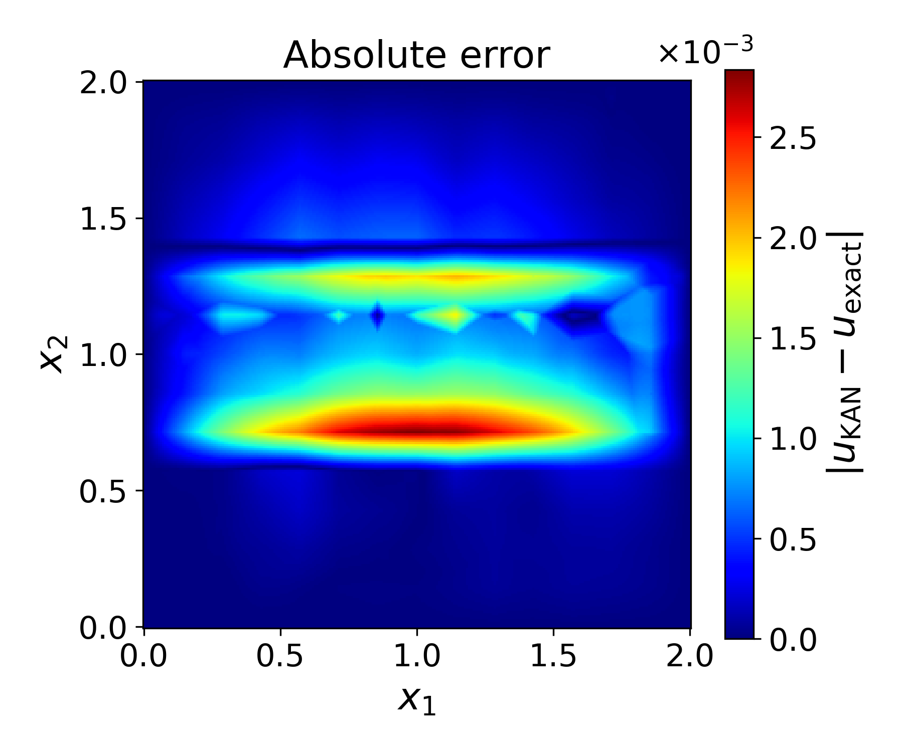

  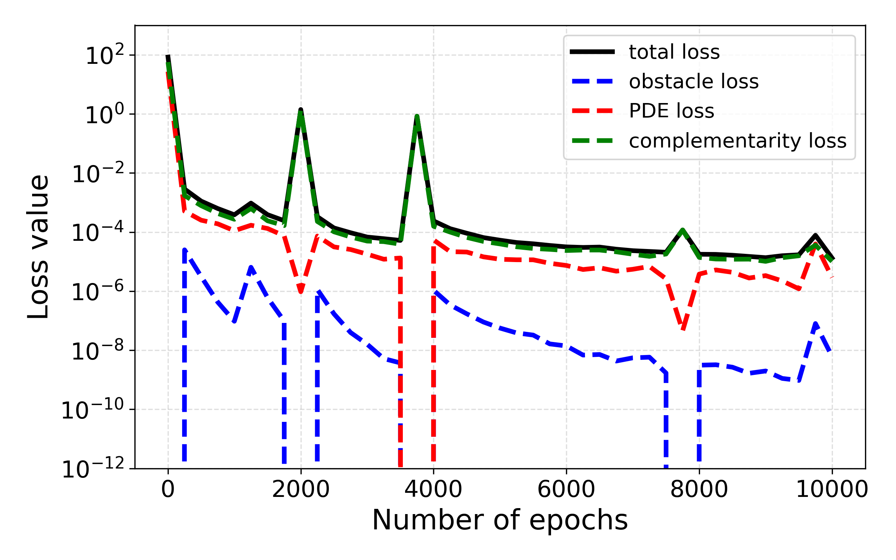
  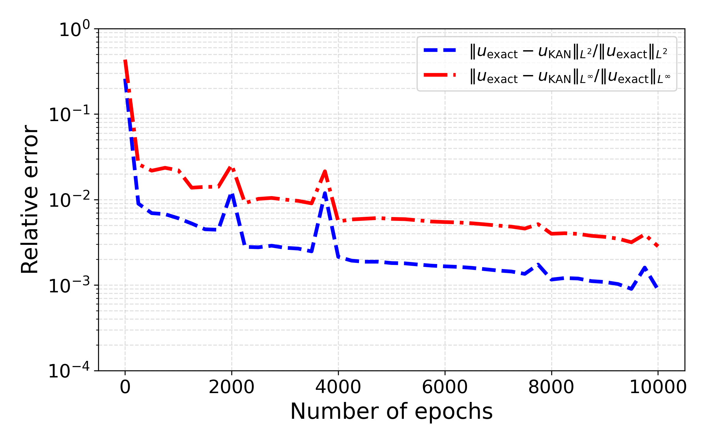

## 6. Repository Features

This repository provides:

- KAN-based approximation of time-dependent PDE solutions
- Free-boundary/interface recovery
- Physics-informed residual loss formulation
- Hard enforcement of selected boundary and initial conditions
- Time-dependent visualization of $u(x_1,x_2,t)$
- Absolute error plots
- Training-loss and relative-error logs
- GitHub-ready GIF generation

---

## 7. Problems Included

The repository contains KAN-based solvers for:

### Elliptic obstacle problem

A benchmark free-boundary problem where the solution is constrained by an obstacle function and the contact region must be recovered.

### Nonlinear p-Laplacian obstacle problem

A nonlinear free-boundary problem involving a p-Laplacian operator, used to test the robustness of KAN approximations for nonlinear PDE constraints.

### Time-dependent Stefan problem

A moving-boundary heat-equation problem where the solution and the free boundary evolve together in time.
